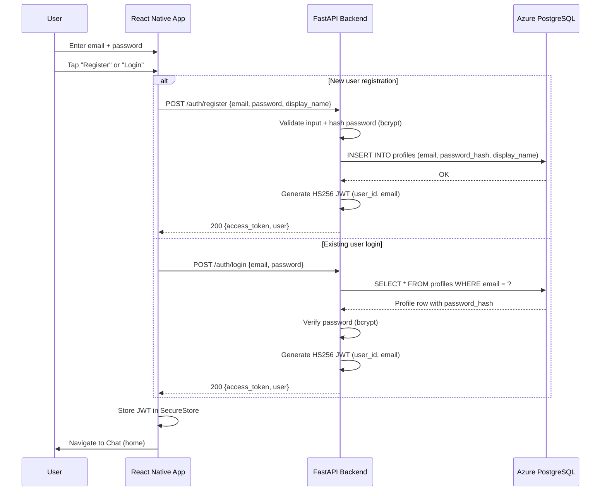
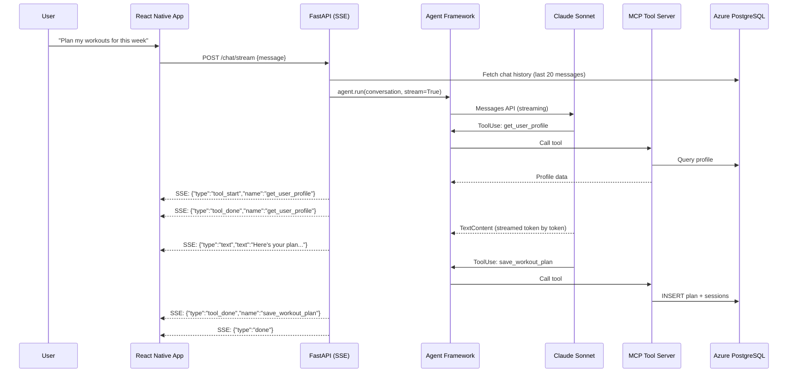
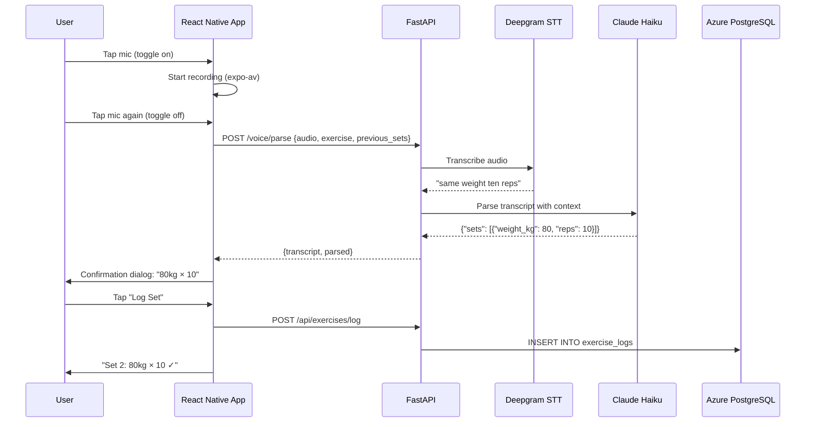
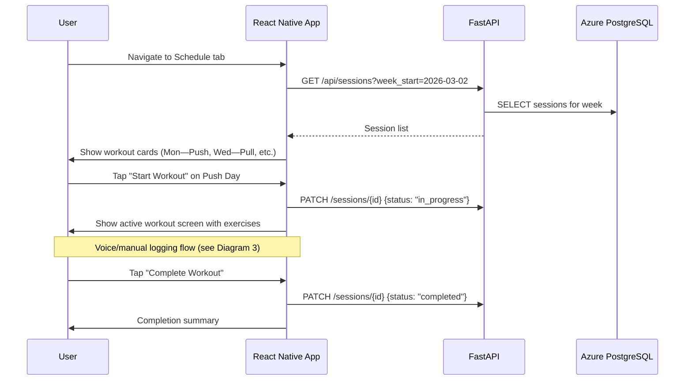

# GymTrainer — Project Plan

## Overview

A personal AI-powered gym trainer app for Android. Chat with a Claude-powered agent that plans balanced weekly workouts, finds YouTube demos for exercises, and tracks progressive overload via voice logging during sessions. Backend runs on Azure, tools exposed via MCP, infrastructure managed with Terraform.

> **Implementation archive:** Phase-by-phase execution logs, build failure history, and deployment
> troubleshooting are in `docs/Implementation Plan Archive.md`.

---

## Tech Stack

| Layer | Technology |
|---|---|
| **Mobile** | React Native (Expo SDK 54, managed workflow), Android only |
| **Agent Orchestration** | Microsoft Agent Framework (`agent-framework-anthropic`) |
| **AI Model** | Claude Sonnet 4.6 (planning agent), Claude Haiku 4.5 (voice parsing) |
| **Tool Protocol** | Model Context Protocol (MCP) — Streamable HTTP transport |
| **Backend** | Python (FastAPI) on Azure Container Apps |
| **Database** | Azure PostgreSQL Flexible Server (v16) |
| **Auth** | Email/password with bcrypt + HS256 JWT (backend-issued) |
| **Voice** | Deepgram STT → Claude Haiku parsing |
| **Design System** | React Native Paper (Material Design 3) |
| **State** | Zustand |
| **Navigation** | Expo Router (file-based) |
| **Infrastructure** | Terraform (azurerm provider) |
| **Streaming** | Server-Sent Events (SSE) via XMLHttpRequest |
| **CI/CD** | GitHub Actions (path-filtered) + EAS Build |
| **OTA Updates** | expo-updates (EAS Update, `appVersion` runtime policy) |

---

## Architecture

```
┌──────────────────────────────────────────────────────────────┐
│                    React Native App (Android)                 │
│                                                              │
│  ┌──────────┐  ┌───────────┐  ┌───────────┐  ┌───────────┐ │
│  │  Chat    │  │  Schedule │  │  Workout  │  │  Progress │ │
│  │  Screen  │  │  Screen   │  │  Screen   │  │  Screen   │ │
│  └────┬─────┘  └─────┬─────┘  └─────┬─────┘  └─────┬─────┘ │
│       │              │              │              │        │
│  ┌────┴──────────────┴──────────────┴──────────────┴─────┐  │
│  │              Zustand State Store                       │  │
│  └────┬──────────────────────────────────────────────────┘  │
│       │  SSE stream + REST                                  │
└───────┼─────────────────────────────────────────────────────┘
        │ HTTPS
        ▼
┌──────────────────────────────────────────────────────────────┐
│              Azure Container Apps (FastAPI)                    │
│                                                              │
│  ┌─────────────────┐     ┌─────────────────────────────┐    │
│  │  /chat/stream    │────▶│  MS Agent Framework          │    │
│  │  (SSE endpoint)  │     │  AnthropicClient (Sonnet)    │    │
│  └─────────────────┘     │         │                     │    │
│                          │    ┌────▼────────────┐        │    │
│  ┌─────────────────┐     │    │  MCP Tool Server │        │    │
│  │  /voice/parse    │     │    │  (HTTP transport)│        │    │
│  │  (Haiku)         │     │    │  ├─ youtube      │        │    │
│  └─────────────────┘     │    │  ├─ exercise_hist │        │    │
│                          │    │  ├─ save_plan     │        │    │
│  ┌─────────────────┐     │    │  └─ user_profile  │        │    │
│  │  /api/* (REST)   │     │    └─────────────────┘        │    │
│  │  CRUD endpoints  │     └─────────────────────────────┘    │
│  └────────┬────────┘                                         │
│           │                                                  │
└───────────┼──────────────────────────────────────────────────┘
            │
     ┌──────┼──────┐
     │             │
     ▼             ▼
 Azure          Azure
 PG DB        Container
              Registry
```

---

## Sequence Diagrams

### 1. Authentication Flow



### 2. Workout Planning (Chat with Agent) — Streaming



### 3. Voice Logging During Workout



### 4. Browse Schedule & Start Workout



---

## User Journeys

| # | Journey | Status |
|---|---------|--------|
| 1 | **First Launch & Sign In** — Register/login with email+password | Done |
| 2 | **Profile Setup** — Set goals, experience, available days | Done |
| 3 | **Workout Planning (Chat)** — Chat with AI to plan a week | Done |
| 4 | **Browse Schedule** — View workout cards, YouTube links, week navigation | Done |
| 5 | **Start a Workout** — Begin session from schedule | Done |
| 6 | **Voice Log Sets** — Mic toggle, Deepgram STT, Haiku parsing, confirmation | Done |
| 7 | **Manual Set Edit** — Tap set to edit/delete, manual add dialog | Done |
| 8 | **Complete Workout** — Mark session done, navigate back | Done |
| 9 | **Check Progress** — Exercise picker, weight-over-time chart | Not started |
| 10 | **Ask AI for Advice** — Ad-hoc chat questions (works via existing chat) | Done |
| 11 | **Re-plan / Adjust Schedule** — "Move Thursday to Saturday" via chat | Done |
| 12 | **Return User Weekly Loop** — Full plan→train→log→progress→re-plan | Partial (needs J9) |

### Journey Dependency Graph

```
J1 (Sign In)
 └─→ J2 (Profile Setup)
      └─→ J3 (Workout Planning Chat)
           ├─→ J4 (Browse Schedule)
           │    └─→ J5 (Start Workout)
           │         ├─→ J6 (Voice Log Sets)
           │         ├─→ J7 (Manual Edit)
           │         └─→ J8 (Complete Workout)
           │              └─→ J9 (Progress) ← NOT YET BUILT
           ├─→ J10 (Ad-hoc Chat)
           └─→ J11 (Re-plan Schedule)
```

---

## MCP Tools (9 total)

| Tool | Parameters | Purpose |
|---|---|---|
| `get_user_profile` | `user_id` | Load goals, experience, days, preferred unit, training objective |
| `update_training_objective` | `user_id, objective` | Set/clear a specific measurable goal |
| `get_exercise_history` | `user_id, exercise_name, limit` | Recent logged sets for progressive overload |
| `get_planned_workouts` | `user_id, start_date, end_date` | Query existing sessions by date range |
| `search_youtube` | `query` | Exercise demo video URL (YouTube Data API or search fallback) |
| `save_workout_plan` | `user_id, week_start, sessions` | Persist full weekly plan (upsert) |
| `add_session_to_week` | `user_id, week_start, day, title, exercises` | Add/replace a single session |
| `update_session` | `user_id, session_id, updates` | Modify session title/exercises/date |
| `delete_session` | `user_id, session_id` | Remove a session and its logs |
| `search_exercises` | `query, limit` | Search canonical exercise database (trigram similarity) |

---

## Database Schema

```sql
-- User profile & training preferences
CREATE TABLE profiles (
    id UUID PRIMARY KEY DEFAULT gen_random_uuid(),
    display_name VARCHAR(100),
    email VARCHAR(255) UNIQUE NOT NULL,
    password_hash VARCHAR(255) NOT NULL,
    training_goals JSONB,
    experience_level VARCHAR(20),
    available_days INT,
    preferred_unit VARCHAR(5) DEFAULT 'kg',
    training_objective TEXT,
    created_at TIMESTAMPTZ DEFAULT NOW(),
    updated_at TIMESTAMPTZ DEFAULT NOW()
);

-- Weekly workout plans generated by AI
CREATE TABLE workout_plans (
    id UUID PRIMARY KEY DEFAULT gen_random_uuid(),
    user_id UUID REFERENCES profiles(id),
    week_start DATE NOT NULL,
    plan_json JSONB NOT NULL,
    notes TEXT,
    created_at TIMESTAMPTZ DEFAULT NOW()
);

-- Individual scheduled workout sessions
CREATE TABLE workout_sessions (
    id UUID PRIMARY KEY DEFAULT gen_random_uuid(),
    user_id UUID REFERENCES profiles(id),
    plan_id UUID REFERENCES workout_plans(id),
    scheduled_date DATE NOT NULL,
    title VARCHAR(100) NOT NULL,
    status VARCHAR(20) DEFAULT 'scheduled',
    exercises JSONB NOT NULL,
    started_at TIMESTAMPTZ,
    completed_at TIMESTAMPTZ,
    created_at TIMESTAMPTZ DEFAULT NOW()
);

-- Individual sets logged during workout
CREATE TABLE exercise_logs (
    id UUID PRIMARY KEY DEFAULT gen_random_uuid(),
    user_id UUID REFERENCES profiles(id),
    session_id UUID REFERENCES workout_sessions(id),
    exercise_name VARCHAR(100) NOT NULL,
    set_number INT NOT NULL,
    weight_kg DECIMAL(5,1),
    reps INT NOT NULL,
    rpe DECIMAL(3,1),
    notes VARCHAR(500),
    logged_at TIMESTAMPTZ DEFAULT NOW()
);

-- Chat history
CREATE TABLE chat_messages (
    id UUID PRIMARY KEY DEFAULT gen_random_uuid(),
    user_id UUID REFERENCES profiles(id),
    role VARCHAR(20) NOT NULL,
    content TEXT NOT NULL,
    tool_calls JSONB,
    created_at TIMESTAMPTZ DEFAULT NOW()
);

-- Canonical exercise reference (62 seeded, auto-grows)
CREATE TABLE exercises (
    id UUID PRIMARY KEY DEFAULT gen_random_uuid(),
    name VARCHAR(100) UNIQUE NOT NULL,
    aliases TEXT[] DEFAULT '{}',
    muscle_group VARCHAR(50),
    category VARCHAR(30),
    equipment VARCHAR(50),
    created_at TIMESTAMPTZ DEFAULT NOW()
);

-- Key indexes
CREATE INDEX idx_exercises_name_trgm ON exercises USING gin (name gin_trgm_ops);
CREATE INDEX idx_exercise_logs_lookup ON exercise_logs(user_id, exercise_name, logged_at);
CREATE INDEX idx_sessions_schedule ON workout_sessions(user_id, scheduled_date);
CREATE INDEX idx_chat_history ON chat_messages(user_id, created_at);
```

**Exercise Name Resolution:** All exercise names pass through a 3-tier resolver on write (exact match → alias match → trigram similarity ≥ 0.4). Unknown exercises are auto-inserted as new canonical entries. See `backend/app/exercise_resolver.py`.

---

## Azure Infrastructure

```
gym-trainer-rg (Resource Group — uksouth)
├── gymtraineracr (Container Registry, Basic)
├── gym-trainer-aca-env (Container Apps Environment + Log Analytics)
│   └── gym-trainer-api (Container App — FastAPI :8000 + MCP :8080)
├── gym-trainer-pg (PostgreSQL Flexible Server, B1ms, v16)
│   └── gym-trainer-db (Database)
└── Key Vault (not deployed — secrets via Container App env vars)
```

**API URL:** `https://gym-trainer-api.bluehill-f327b734.uksouth.azurecontainerapps.io`

**Estimated cost:** ~£14-19/month (PostgreSQL £10, Container Apps £0-5, ACR £3.50)

---

## CI/CD Pipeline

| Trigger | What runs |
|---------|-----------|
| **PR** | expo-doctor, TypeScript, ESLint, Jest, pytest |
| **Push to main** (backend/ changed) | Above + Docker build → ACR → Container App revision |
| **Push to main** (mobile/ changed) | Above + EAS preview APK build |
| **Git tag `v*`** | Above + EAS production app-bundle for Play Store |

Deploy script tags images with git commit SHA to ensure Azure always creates a new revision.

---

## Design Decisions

1. **Expo managed workflow + React Native Paper** — MD3 components, built-in theming/dark mode, Expo config plugins for all native modules
2. **JSONB in PostgreSQL** — Rich JSON operators for plan/exercise/goals columns, `asyncpg` for async access
3. **LLM voice parsing via Haiku** — Handles "same as last time but add 5", "drop set", "to failure" — regex can't
4. **SSE over WebSockets** — Simpler, HTTP-based, no bidirectional needed for chat streaming
5. **MCP over inline tools** — Independently testable, reusable across agents, compatible with Claude Desktop
6. **Agent Framework over raw Claude API** — Session management, middleware, OpenTelemetry, model-agnostic
7. **Azure Container Apps over Functions** — Long-running SSE connections, scales to zero
8. **Chat-first UX** — Planning happens conversationally, structured output renders as interactive cards

---

## Remaining Work

### Journey 9: Progress Screen
- Exercise picker populated from canonical `exercises` table
- Line chart (weight over time) using `react-native-chart-kit`
- History table (recent sets)
- Backend route for chart data query

### Polish & Quality
- RestTimer component for active workouts
- Error handling / offline / retry states in chat
- Schedule empty states ("No plan yet — chat with your trainer")
- Workout index screen (list/start sessions)
- Full Journey 12 walkthrough validation

### Future Considerations
- iOS support (requires Apple Developer account — $99/year)
- Google Play Store release (tag `v*` triggers production build)
- Key Vault for secrets (currently env vars on Container App)
- Native Android STT as alternative to Deepgram (package TBD — `@react-native-voice/voice` was removed due to AndroidX conflicts)
