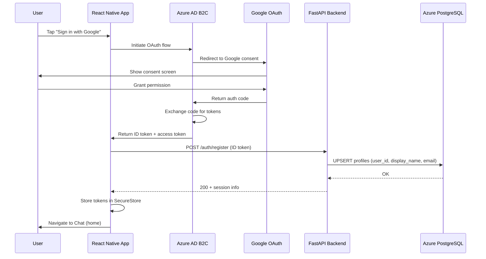
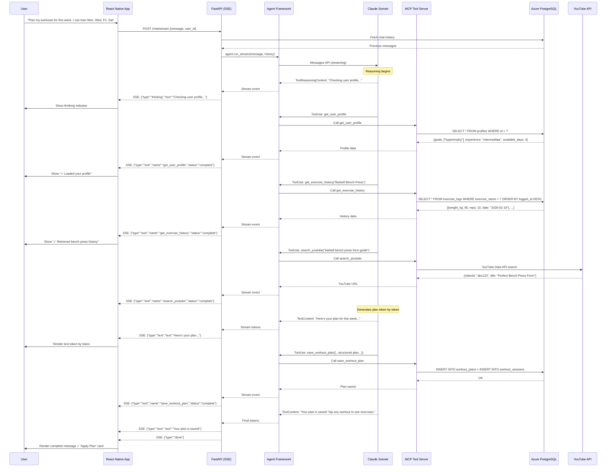
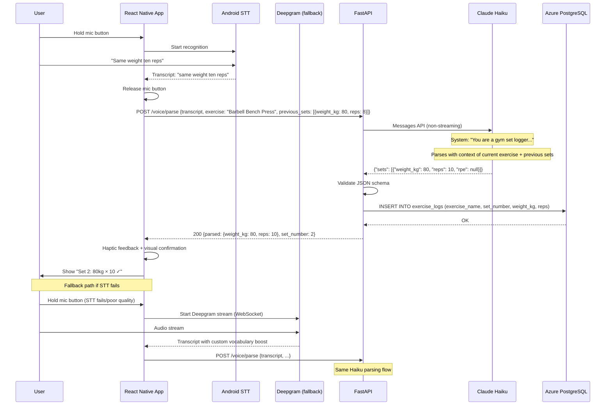
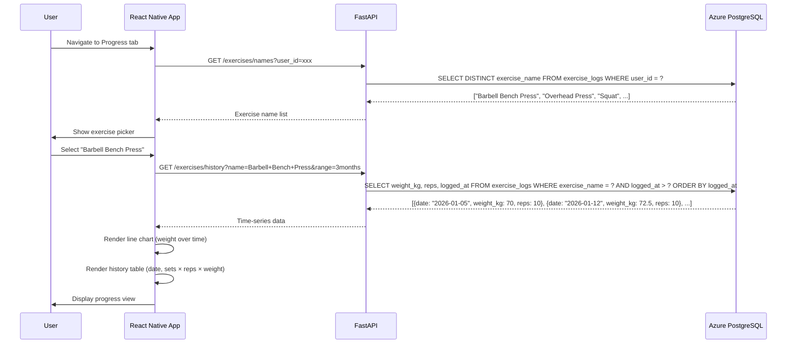
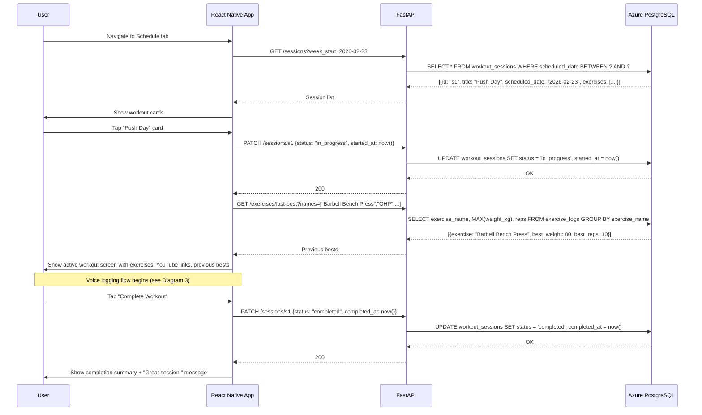
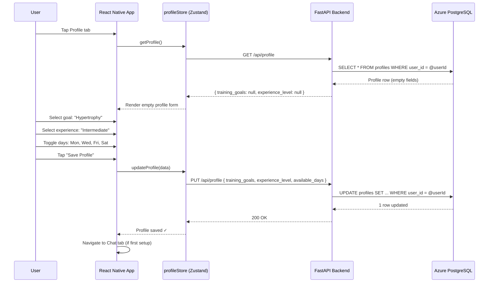
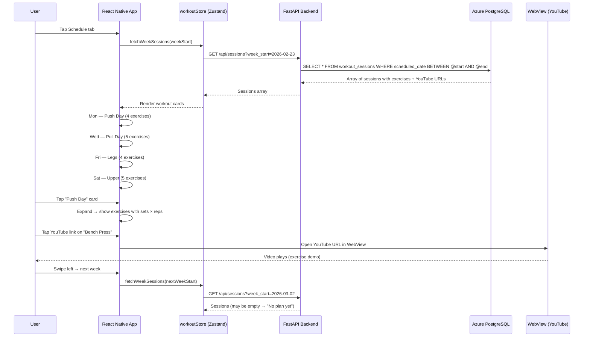
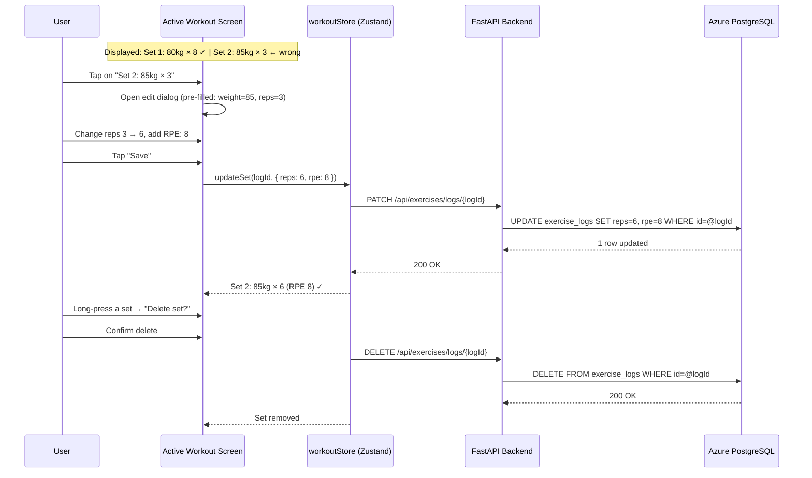
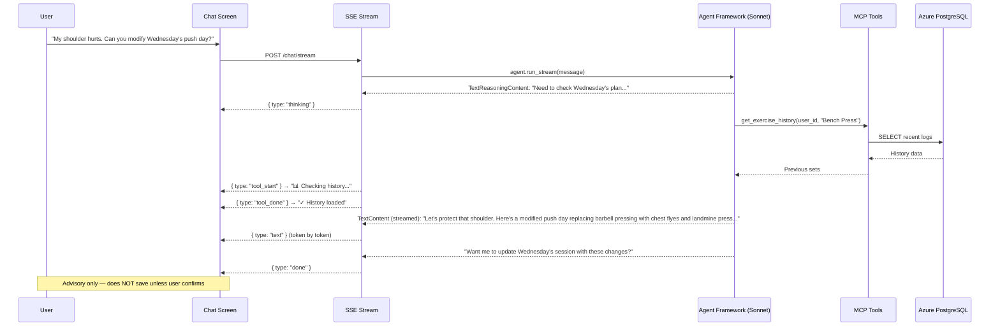
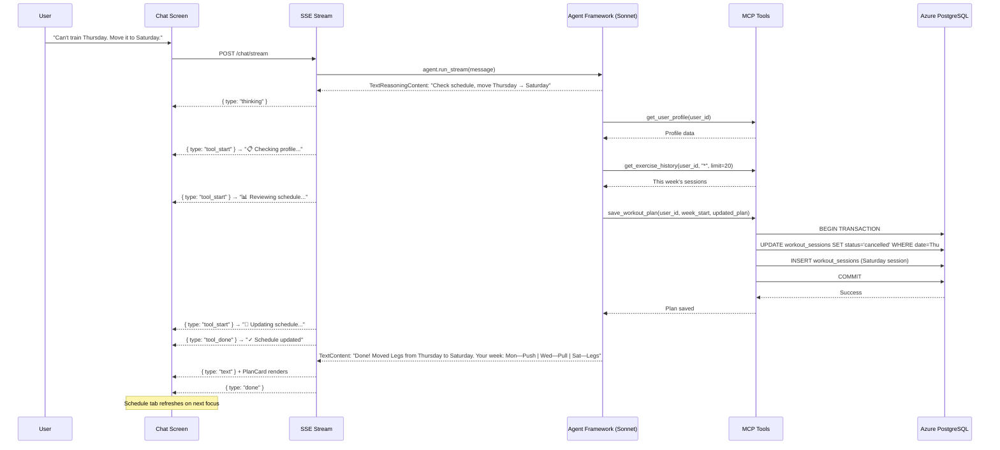

# GymTrainer — React Native App Project Plan v2

## Overview

A personal AI-powered gym trainer app for Android. Chat with a Claude-powered agent (via Microsoft Agent Framework) that plans balanced weekly workouts, finds YouTube demos for exercises, and tracks progressive overload via voice logging during sessions. Backend runs on Azure, tools exposed via MCP, infrastructure managed with Terraform.

---

## Tech Stack

| Layer | Technology |
|---|---|
| **Mobile Framework** | React Native (Expo managed workflow), Android only |
| **Agent Orchestration** | Microsoft Agent Framework (`agent-framework-anthropic`) |
| **AI Models** | Claude Sonnet (planning agent), Claude Haiku (voice parsing) |
| **Tool Protocol** | Model Context Protocol (MCP) — HTTP transport |
| **Backend Runtime** | Python (FastAPI) on Azure Container Apps |
| **Database** | Azure PostgreSQL Flexible Server |
| **Auth** | Azure AD B2C with Google identity provider |
| **Voice (primary)** | Android native STT (`@react-native-voice/voice`) |
| **Voice (fallback)** | Deepgram streaming API |
| **Design System** | React Native Paper (Material Design 3) |
| **Charts** | `react-native-chart-kit` or `victory-native` |
| **State** | Zustand |
| **Navigation** | Expo Router |
| **Infrastructure** | Terraform (azurerm provider) |
| **Streaming** | Server-Sent Events (SSE) |

---

## Architecture

```
┌──────────────────────────────────────────────────────────────┐
│                    React Native App (Android)                 │
│                                                              │
│  ┌──────────┐  ┌───────────┐  ┌───────────┐  ┌───────────┐ │
│  │  Chat    │  │  Schedule │  │  Workout  │  │  Progress │ │
│  │  Screen  │  │  Screen   │  │  Screen   │  │  Screen   │ │
│  └────┬─────┘  └─────┬─────┘  └─────┬─────┘  └─────┬─────┘ │
│       │              │              │              │        │
│  ┌────┴──────────────┴──────────────┴──────────────┴─────┐  │
│  │              Zustand State Store                       │  │
│  └────┬──────────────────────────────────────────────────┘  │
│       │  SSE stream + REST                                  │
└───────┼─────────────────────────────────────────────────────┘
        │ HTTPS
        ▼
┌──────────────────────────────────────────────────────────────┐
│              Azure Container Apps (FastAPI)                    │
│                                                              │
│  ┌─────────────────┐     ┌─────────────────────────────┐    │
│  │  /chat/stream    │────▶│  MS Agent Framework          │    │
│  │  (SSE endpoint)  │     │  AnthropicClient (Sonnet)    │    │
│  └─────────────────┘     │         │                     │    │
│                          │    ┌────▼────────────┐        │    │
│  ┌─────────────────┐     │    │  MCP Tool Server │        │    │
│  │  /voice/parse    │     │    │  (HTTP transport)│        │    │
│  │  (Haiku)         │     │    │  ├─ youtube      │        │    │
│  └─────────────────┘     │    │  ├─ exercise_hist │        │    │
│                          │    │  ├─ save_plan     │        │    │
│  ┌─────────────────┐     │    │  └─ user_profile  │        │    │
│  │  /api/* (REST)   │     │    └─────────────────┘        │    │
│  │  CRUD endpoints  │     └─────────────────────────────┘    │
│  └────────┬────────┘                                         │
│           │                                                  │
└───────────┼──────────────────────────────────────────────────┘
            │
     ┌──────┼──────┐
     │      │      │
     ▼      ▼      ▼
 Azure    Azure   Azure
 PG DB   AD B2C  Container
                  Registry
```

---

## Sequence Diagrams

### 1. Authentication Flow



### 2. Workout Planning (Chat with Agent) — Streaming



### 3. Voice Logging During Workout



### 4. Progressive Overload View



### 5. Starting a Scheduled Workout



### 6. Profile Setup



### 7. Browse Schedule



### 8. Manual Set Edit



### 9. Ad-hoc Chat (Ask AI for Advice)



### 10. Re-plan / Adjust Schedule



---

## User Journeys

| # | Journey | Key Screens | Sequence Diagram | Depends On |
|---|---------|-------------|-----------------|------------|
| 1 | **First Launch & Sign In** | Login → Chat | `01-auth-flow` | — |
| 2 | **Profile Setup** | Profile tab | `07-profile-setup` | J1 |
| 3 | **Workout Planning (Chat)** | Chat tab | `02-chat-streaming` | J1, J2 |
| 4 | **Browse Schedule** | Schedule tab | `08-browse-schedule` | J3 |
| 5 | **Start a Workout** | Active workout screen | `05-workout-session` | J4 |
| 6 | **Voice Log Sets** | Active workout + mic | `03-voice-logging` | J5 |
| 7 | **Manual Set Edit** | Active workout + dialog | `09-manual-set-edit` | J5 |
| 8 | **Complete Workout** | Active workout → summary | `05-workout-session` | J5 |
| 9 | **Check Progress** | Progress tab | `04-progress-view` | J8 (needs logged data) |
| 10 | **Ask AI for Advice** | Chat tab | `10-adhoc-chat` | J3 |
| 11 | **Re-plan / Adjust Schedule** | Chat tab → Schedule | `11-replan-schedule` | J3 |
| 12 | **Return User Weekly Loop** | Chat → Schedule → Workout → Progress | Composite of above | All |

---

## Azure Infrastructure (Terraform)

### Resource Map

```
gym-trainer-rg (Resource Group)
├── gym-trainer-acr (Azure Container Registry)
├── gym-trainer-aca-env (Container Apps Environment)
│   └── gym-trainer-api (Container App — FastAPI + MCP server)
├── gym-trainer-pg (Azure PostgreSQL Flexible Server)
│   └── gym-trainer-db (PostgreSQL Database)
├── gym-trainer-b2c (Azure AD B2C Tenant)
├── gym-trainer-kv (Key Vault — API keys, connection strings)
└── gym-trainer-log (Log Analytics Workspace)
```

### Terraform Module Structure

```
infra/
├── main.tf                    # Provider config, resource group
├── variables.tf               # Input variables
├── outputs.tf                 # Connection strings, endpoints
├── terraform.tfvars           # Personal config values
├── modules/
│   ├── postgresql/
│   │   ├── main.tf            # Azure PostgreSQL Flexible Server + Database
│   │   ├── variables.tf
│   │   └── outputs.tf
│   ├── container-apps/
│   │   ├── main.tf            # ACR + ACA Environment + Container App
│   │   ├── variables.tf
│   │   └── outputs.tf
│   ├── auth/
│   │   ├── main.tf            # AD B2C tenant + Google IdP + App registration
│   │   ├── variables.tf
│   │   └── outputs.tf
│   └── keyvault/
│       ├── main.tf            # Key Vault + secrets
│       ├── variables.tf
│       └── outputs.tf
└── scripts/
    ├── seed.sql               # Initial schema migration
    └── deploy.sh              # Build + push container + deploy
```

### Key Terraform Resources

```hcl
# Container App (API + MCP server)
resource "azurerm_container_app" "api" {
  name                         = "gym-trainer-api"
  container_app_environment_id = azurerm_container_app_environment.env.id
  resource_group_name          = azurerm_resource_group.rg.name

  template {
    container {
      name   = "api"
      image  = "${azurerm_container_registry.acr.login_server}/gym-trainer-api:latest"
      cpu    = 0.5
      memory = "1Gi"

      env {
        name        = "ANTHROPIC_API_KEY"
        secret_name = "anthropic-api-key"
      }
      env {
        name        = "DATABASE_URL"
        secret_name = "database-url"
      }
      env {
        name        = "YOUTUBE_API_KEY"
        secret_name = "youtube-api-key"
      }
      env {
        name        = "DEEPGRAM_API_KEY"
        secret_name = "deepgram-api-key"
      }
    }
    min_replicas = 0   # Scale to zero when idle (personal project)
    max_replicas = 1
  }

  ingress {
    external_enabled = true
    target_port      = 8000
    transport        = "http"
  }
}

# Azure PostgreSQL (Burstable B1ms — good for personal use)
resource "azurerm_postgresql_flexible_server" "pg" {
  name                   = "gym-trainer-pg"
  resource_group_name    = azurerm_resource_group.rg.name
  location               = azurerm_resource_group.rg.location
  administrator_login    = var.pg_admin_username
  administrator_password = var.pg_admin_password
  sku_name               = "B_Standard_B1ms"  # ~£10/month
  storage_mb             = 32768
  version                = "16"
}

resource "azurerm_postgresql_flexible_server_database" "db" {
  name      = "gym-trainer-db"
  server_id = azurerm_postgresql_flexible_server.pg.id
  collation = "en_US.utf8"
  charset   = "UTF8"
}
```

### Estimated Monthly Cost (Personal Use)

| Resource | SKU | ~Cost/month |
|---|---|---|
| Azure PostgreSQL | Burstable B1ms | £10 |
| Container Apps | Consumption (scale to 0) | £0-5 |
| Container Registry | Basic | £3.50 |
| AD B2C | Free tier (50k auth/month) | £0 |
| Key Vault | Standard | £0.02 |
| Log Analytics | Free tier (5GB) | £0 |
| **Total** | | **~£14-19/month** |

---

## Microsoft Agent Framework — Agent Design

### Agent Setup (Python)

```python
from agent_framework.anthropic import AnthropicClient

# Planning agent (Sonnet)
planning_client = AnthropicClient(model_id="claude-sonnet-4-5-20250929")

gym_agent = planning_client.as_agent(
    name="GymTrainer",
    instructions=GYM_TRAINER_SYSTEM_PROMPT,
    tools=[
        planning_client.get_mcp_tool(
            name="gym-tools",
            url="http://localhost:8080/mcp",  # Co-hosted MCP server
        ),
    ],
    max_tokens=4096,
)

# Voice parser (Haiku) — separate lightweight agent, no MCP tools needed
voice_client = AnthropicClient(model_id="claude-haiku-4-5-20251001")

voice_parser = voice_client.as_agent(
    name="VoiceParser",
    instructions=VOICE_PARSE_SYSTEM_PROMPT,
    max_tokens=256,
)
```

### System Prompts

**GymTrainer (Sonnet):**
```
You are a personal gym trainer AI. You plan balanced weekly workouts based on the
user's goals, experience level, and available training days.

Behaviour:
- Always check the user's profile before planning
- Review exercise history to suggest progressive overload
- Find YouTube demos for each exercise using search_youtube
- Design balanced splits (push/pull/legs, upper/lower, etc.) based on available days
- Use canonical exercise names consistently (e.g., "Barbell Bench Press" not "bench")
- Save completed plans using save_workout_plan
- Be conversational but concise

When planning, ensure:
- Each muscle group is hit 2x/week minimum
- Compound movements before isolation
- Appropriate volume for the user's experience level
- Rest days between same muscle groups
```

**VoiceParser (Haiku):**
```
You are a gym workout set logger. Parse voice transcripts into structured JSON.

Context provided: current_exercise, previous_sets, last_session_best

Rules:
- "same weight" / "same as before" → use weight from previous_sets
- "add X" / "plus X" → add to previous weight
- "drop set" → multiple sets with decreasing weight
- "bodyweight" / "BW" → weight_kg: 0
- "to failure" → rpe: 10
- Default unit is kg unless user says lbs (convert: lbs × 0.4536)
- If reps not mentioned, return { "needs_clarification": "How many reps?" }

Respond ONLY with valid JSON:
{ "sets": [{ "weight_kg": number, "reps": number, "rpe": number|null }] }
or
{ "needs_clarification": "question" }
```

---

## MCP Tool Server

Implemented as a FastMCP Python server, co-hosted with the FastAPI backend.

```python
from fastmcp import FastMCP

mcp = FastMCP("gym-tools")

@mcp.tool()
async def get_user_profile(user_id: str) -> dict:
    """Get the user's training profile including goals, experience, and preferences."""
    ...

@mcp.tool()
async def get_exercise_history(user_id: str, exercise_name: str, limit: int = 10) -> list:
    """Get recent logged sets for a specific exercise. Returns weight, reps, RPE, and date."""
    ...

@mcp.tool()
async def search_youtube(query: str) -> dict:
    """Search YouTube for exercise demonstration videos. Returns video URL and title."""
    ...

@mcp.tool()
async def save_workout_plan(user_id: str, week_start: str, plan: dict) -> dict:
    """Save a structured weekly workout plan and create workout sessions."""
    ...

# Run MCP server alongside FastAPI
# FastAPI on :8000, MCP on :8080
```

---

## Streaming Architecture (SSE)

### Backend SSE Endpoint

```python
from fastapi import FastAPI
from fastapi.responses import StreamingResponse
import json

app = FastAPI()

@app.post("/chat/stream")
async def chat_stream(request: ChatRequest):
    async def event_generator():
        async for event in gym_agent.run_stream(request.message):
            if isinstance(event, TextReasoningContent):
                yield f"data: {json.dumps({'type': 'thinking', 'text': event.text})}\n\n"
            elif isinstance(event, ToolCallContent):
                yield f"data: {json.dumps({'type': 'tool_start', 'name': event.name})}\n\n"
            elif isinstance(event, ToolResultContent):
                yield f"data: {json.dumps({'type': 'tool_done', 'name': event.name})}\n\n"
            elif isinstance(event, TextContent):
                yield f"data: {json.dumps({'type': 'text', 'text': event.text})}\n\n"
        yield f"data: {json.dumps({'type': 'done'})}\n\n"

    return StreamingResponse(event_generator(), media_type="text/event-stream")
```

### React Native SSE Consumer

```typescript
const streamChat = async (message: string) => {
  const response = await fetch(`${API_URL}/chat/stream`, {
    method: 'POST',
    headers: { 'Content-Type': 'application/json', Authorization: `Bearer ${token}` },
    body: JSON.stringify({ message, user_id }),
  });

  const reader = response.body?.getReader();
  const decoder = new TextDecoder();

  while (true) {
    const { done, value } = await reader!.read();
    if (done) break;

    const chunk = decoder.decode(value);
    const lines = chunk.split('\n').filter(l => l.startsWith('data: '));

    for (const line of lines) {
      const event = JSON.parse(line.slice(6));

      switch (event.type) {
        case 'thinking':
          updateThinkingBlock(event.text);
          break;
        case 'tool_start':
          addToolIndicator(event.name, 'loading');
          break;
        case 'tool_done':
          updateToolIndicator(event.name, 'complete');
          break;
        case 'text':
          appendMessageText(event.text);
          break;
        case 'done':
          finalizeMessage();
          break;
      }
    }
  }
};
```

---

## Database Schema (Azure PostgreSQL)

```sql
-- User profile & training preferences
CREATE TABLE profiles (
    id UUID PRIMARY KEY,  -- matches Azure AD B2C object ID
    display_name VARCHAR(100),
    email VARCHAR(255),
    training_goals JSONB,              -- ["hypertrophy", "strength"]
    experience_level VARCHAR(20),      -- beginner, intermediate, advanced
    available_days INT,
    preferred_unit VARCHAR(5) DEFAULT 'kg',  -- kg or lbs
    created_at TIMESTAMPTZ DEFAULT NOW(),
    updated_at TIMESTAMPTZ DEFAULT NOW()
);

-- Weekly workout plans generated by AI
CREATE TABLE workout_plans (
    id UUID PRIMARY KEY DEFAULT gen_random_uuid(),
    user_id UUID REFERENCES profiles(id),
    week_start DATE NOT NULL,
    plan_json JSONB NOT NULL,          -- Full structured plan from Claude
    notes TEXT,
    created_at TIMESTAMPTZ DEFAULT NOW()
);

-- Individual scheduled workout sessions
CREATE TABLE workout_sessions (
    id UUID PRIMARY KEY DEFAULT gen_random_uuid(),
    user_id UUID REFERENCES profiles(id),
    plan_id UUID REFERENCES workout_plans(id),
    scheduled_date DATE NOT NULL,
    title VARCHAR(100) NOT NULL,
    status VARCHAR(20) DEFAULT 'scheduled',  -- scheduled, in_progress, completed, skipped
    exercises JSONB NOT NULL,                 -- exercises with YouTube URLs
    started_at TIMESTAMPTZ,
    completed_at TIMESTAMPTZ,
    created_at TIMESTAMPTZ DEFAULT NOW()
);

-- Individual sets logged during workout (progressive overload data)
CREATE TABLE exercise_logs (
    id UUID PRIMARY KEY DEFAULT gen_random_uuid(),
    user_id UUID REFERENCES profiles(id),
    session_id UUID REFERENCES workout_sessions(id),
    exercise_name VARCHAR(100) NOT NULL,
    set_number INT NOT NULL,
    weight_kg DECIMAL(5,1),
    reps INT NOT NULL,
    rpe DECIMAL(3,1),
    notes VARCHAR(500),
    logged_at TIMESTAMPTZ DEFAULT NOW()
);

-- Chat history with the AI agent
CREATE TABLE chat_messages (
    id UUID PRIMARY KEY DEFAULT gen_random_uuid(),
    user_id UUID REFERENCES profiles(id),
    role VARCHAR(20) NOT NULL,  -- 'user' or 'assistant'
    content TEXT NOT NULL,
    tool_calls JSONB,           -- if Claude used tools
    created_at TIMESTAMPTZ DEFAULT NOW()
);

-- Indexes for performance
CREATE INDEX idx_exercise_logs_lookup ON exercise_logs(user_id, exercise_name, logged_at);
CREATE INDEX idx_sessions_schedule ON workout_sessions(user_id, scheduled_date);
CREATE INDEX idx_chat_history ON chat_messages(user_id, created_at);
```

---

## Project Structure

```
gym-trainer/
├── CLAUDE.md                       # Agent team instructions
├── infra/                          # Terraform (Agent: infra-agent)
│   ├── main.tf
│   ├── variables.tf
│   ├── outputs.tf
│   ├── terraform.tfvars
│   ├── modules/
│   │   ├── sql/
│   │   ├── container-apps/
│   │   ├── auth/
│   │   └── keyvault/
│   └── scripts/
│       ├── seed.sql
│       └── deploy.sh
├── backend/                        # Python FastAPI (Agent: backend-agent)
│   ├── Dockerfile
│   ├── requirements.txt
│   ├── app/
│   │   ├── main.py                 # FastAPI app + SSE endpoints
│   │   ├── config.py               # Settings from env vars
│   │   ├── auth.py                 # Azure AD B2C token validation
│   │   ├── agent/
│   │   │   ├── gym_trainer.py      # Agent Framework setup + system prompt
│   │   │   ├── voice_parser.py     # Haiku voice parsing agent
│   │   │   └── prompts.py          # System prompts
│   │   ├── mcp/
│   │   │   ├── server.py           # FastMCP tool server
│   │   │   ├── tools/
│   │   │   │   ├── youtube.py      # search_youtube tool
│   │   │   │   ├── exercises.py    # get_exercise_history tool
│   │   │   │   ├── plans.py        # save_workout_plan tool
│   │   │   │   └── profile.py      # get_user_profile tool
│   │   │   └── __init__.py
│   │   ├── routes/
│   │   │   ├── chat.py             # POST /chat/stream (SSE)
│   │   │   ├── voice.py            # POST /voice/parse
│   │   │   ├── sessions.py         # CRUD workout sessions
│   │   │   ├── exercises.py        # Exercise history + progress
│   │   │   └── profile.py          # User profile CRUD
│   │   └── db.py                   # PostgreSQL connection (asyncpg)
│   └── tests/
│       ├── test_mcp_tools.py
│       ├── test_voice_parser.py
│       └── test_routes.py
├── mobile/                         # React Native Expo (Agents: frontend-agent, workout-agent)
│   ├── app/
│   │   ├── _layout.tsx             # Root layout (tab navigator)
│   │   ├── (tabs)/
│   │   │   ├── index.tsx           # Chat screen (home)
│   │   │   ├── schedule.tsx        # Schedule screen
│   │   │   ├── workout/
│   │   │   │   ├── index.tsx       # Workout list
│   │   │   │   └── [sessionId].tsx # Active workout
│   │   │   ├── progress.tsx        # Progress charts
│   │   │   └── profile.tsx         # Settings
│   │   └── auth/
│   │       └── login.tsx           # Google sign-in via B2C
│   ├── components/
│   │   ├── chat/
│   │   │   ├── MessageBubble.tsx
│   │   │   ├── ThinkingBlock.tsx   # Collapsible reasoning display
│   │   │   ├── ToolIndicator.tsx   # "🔍 Searching..." → "✓ Found"
│   │   │   ├── StreamingText.tsx   # Token-by-token text render
│   │   │   ├── ChatInput.tsx
│   │   │   └── PlanCard.tsx        # Rendered workout plan from AI
│   │   ├── workout/
│   │   │   ├── ExerciseCard.tsx
│   │   │   ├── SetLogger.tsx
│   │   │   ├── VoiceButton.tsx
│   │   │   └── RestTimer.tsx
│   │   └── progress/
│   │       ├── WeightChart.tsx
│   │       └── HistoryTable.tsx
│   ├── services/
│   │   ├── api.ts                  # Base API client + auth headers
│   │   ├── sse.ts                  # SSE stream consumer
│   │   ├── voice.ts                # STT abstraction (native + Deepgram)
│   │   └── auth.ts                 # Azure AD B2C auth flow
│   ├── theme.ts                    # React Native Paper MD3 theme config
│   ├── stores/
│   │   ├── authStore.ts
│   │   ├── chatStore.ts
│   │   ├── workoutStore.ts
│   │   └── profileStore.ts
│   ├── types/
│   │   └── index.ts
│   ├── app.json
│   ├── eas.json                    # EAS Build profiles (dev/preview/production)
│   ├── package.json
│   └── tsconfig.json
├── .github/
│   └── workflows/
│       └── ci.yml                  # Lint + test + preview build on main
└── docs/
    └── architecture.md             # This document
```

---

## Claude Code Agent Team — Implementation Strategy

### Approach

Using Claude Code Agent Teams to parallelise implementation across 4 specialist agents. Each agent owns a distinct set of files with zero overlap, coordinated by a lead agent in delegate mode.

Key principles:
- **Strict file ownership** — no two agents edit the same file
- **Rich spawn prompts** — each agent gets full context about the project, conventions, and their specific scope
- **Delegate mode** — lead only coordinates, never implements
- **Journey-based execution** — after Foundation, each phase delivers complete end-to-end user journeys (backend + frontend + stores). No disconnected features.
- **Gates between phases** — each phase has an acceptance test: "can the user do X end-to-end?"

### Team Structure

```
┌─────────────────────────────────────────────────────────────┐
│                    LEAD (You + Claude Code)                   │
│                    Mode: Delegate                            │
│                    Role: Coordinate, review, unblock         │
├──────────┬──────────┬──────────────────┬────────────────────┤
│          │          │                  │                    │
│  infra   │ backend  │  frontend-chat   │  frontend-workout  │
│  agent   │  agent   │    agent         │     agent          │
│          │          │                  │                    │
│ Owns:    │ Owns:    │ Owns:            │ Owns:              │
│ infra/*  │ backend/*│ mobile/app/      │ mobile/app/        │
│          │          │  (tabs)/index    │  (tabs)/schedule   │
│          │          │ mobile/          │  (tabs)/workout/*  │
│          │          │  components/     │  (tabs)/progress   │
│          │          │  chat/*          │  (tabs)/profile    │
│          │          │ mobile/          │ mobile/             │
│          │          │  services/       │  components/       │
│          │          │  sse.ts          │  workout/*         │
│          │          │  api.ts          │  progress/*        │
│          │          │ mobile/stores/   │ mobile/services/   │
│          │          │  chatStore.ts    │  voice.ts          │
│          │          │ mobile/          │ mobile/stores/     │
│          │          │  theme.ts        │  workoutStore.ts   │
└──────────┴──────────┴──────────────────┴────────────────────┘
```

### Execution Plan — Journey-Based (16 Working Hours)

Implementation is structured as **Foundation + 5 Journey Phases**. Foundation builds all scaffolding and infrastructure. Each subsequent phase delivers 1-3 complete user journeys end-to-end, across all layers (backend routes, MCP tools, agent integration, frontend screens, stores). Agents still work in parallel within each phase, but the work is organised around delivering working user flows rather than disconnected features.

#### Foundation (Hours 0-4) — All 4 agents in parallel ✅ COMPLETED

**Goal:** Deployable infrastructure, running app with navigation, auth plumbed, DB schema live.

| Agent | Tasks | Files | Status |
|---|---|---|---|
| **infra-agent** | T1: Terraform modules (PostgreSQL, ACA, ACR, KV) | `infra/**` | ✅ |
| | T2: seed.sql schema migration | `infra/scripts/seed.sql` | ✅ |
| | T3: Dockerfile + deploy script | `backend/Dockerfile`, `infra/scripts/deploy.sh` | ✅ |
| | T4: GitHub Actions CI + EAS config | `.github/workflows/`, `mobile/eas.json` | ✅ |
| **backend-agent** | T1: FastAPI scaffold + config + DB connection | `backend/app/main.py`, `config.py`, `db.py` | ✅ |
| | T2: Auth middleware (AD B2C token validation) | `backend/app/auth.py` | ✅ |
| | T3: Profile REST routes (GET/PUT) | `backend/app/routes/profile.py` | ✅ |
| **frontend-chat-agent** | T1: Expo project init + navigation scaffold | `mobile/app/_layout.tsx`, `package.json` | ✅ |
| | T2: Paper theme config (colours, fonts, dark mode) | `mobile/theme.ts` | ✅ |
| | T3: API service (base client + auth headers) | `mobile/services/api.ts` | ✅ |
| | T4: Auth service (B2C + Google Sign-In) | `mobile/services/auth.ts` | ✅ |
| **frontend-workout-agent** | T1: Type definitions (all shared types) | `mobile/types/index.ts` | ✅ |
| | T2: Workout store skeleton | `mobile/stores/workoutStore.ts` | ✅ |
| | T3: Profile store skeleton | `mobile/stores/profileStore.ts` | ✅ |

**Gate:** Backend serves `/health`, Terraform plans clean, Expo app launches with tab navigation, API service can make authenticated requests.

**Decision log:** Switched from Azure SQL to Azure PostgreSQL Flexible Server (JSONB, asyncpg, better Python DX). Updated all schema, Terraform modules, and backend to use PostgreSQL.

---

#### Phase 1: Onboarding — Journeys 1 & 2 (Hours 4-6) ✅ COMPLETED

**Delivers:** User can sign in with Google and set up their training profile.

| Agent | Tasks | Journey | Files | Status |
|---|---|---|---|---|
| **infra-agent** | T5: Terraform validate + fix issues | — | `infra/**` | ✅ |
| | T6: Integration test script (test-api.sh) | — | `infra/scripts/test-api.sh` | ✅ |
| **backend-agent** | T4: Profile route tests (7 tests, all passing) | J2 | `backend/tests/` | ✅ |
| **frontend-chat-agent** | T5: Login screen (Google Sign-In via B2C) | J1 | `mobile/app/auth/login.tsx` | ✅ |
| | T6: Auth store (tokens, user state, SecureStore) | J1 | `mobile/stores/authStore.ts` | ✅ |
| | T7: Auth-gated layout (redirect to login if no token) | J1 | `mobile/app/_layout.tsx` | ✅ |
| **frontend-workout-agent** | T4: Profile screen (form + save) | J2 | `mobile/app/(tabs)/profile.tsx` | ✅ |
| | T5: Profile store (GET/PUT integration) | J2 | `mobile/stores/profileStore.ts` | ✅ |

**Gate:** Can sign in with Google → lands on chat → navigate to Profile → fill in goals/experience/days → save → data persists in Azure PostgreSQL. Infra deployed and reachable.

**Notes:** Terraform validated and fixed (auth module missing resource_group_name). Actual `terraform apply` deferred to manual deployment. Type mismatch between api.ts UserProfile and types/index.ts Profile flagged — to be aligned in Phase 2.

---

#### Phase 2: Workout Planning — Journeys 3 & 4 (Hours 6-10)

**Delivers:** User can chat with AI trainer to plan a week, see the plan on the schedule screen with YouTube links.

| Agent | Tasks | Journey | Files | Hours |
|---|---|---|---|---|
| **backend-agent** | T5: MCP tool server (all 4 tools) | J3 | `backend/app/mcp/**` | 2h |
| | T6: Agent Framework setup (Sonnet client + system prompt) | J3 | `backend/app/agent/gym_trainer.py`, `prompts.py` | 1h |
| | T7: SSE chat endpoint | J3 | `backend/app/routes/chat.py` | 1.5h |
| | T8: Sessions REST routes (GET week, GET by id) | J4 | `backend/app/routes/sessions.py` | 0.5h |
| **frontend-chat-agent** | T8: SSE consumer service | J3 | `mobile/services/sse.ts` | 1h |
| | T9: Chat screen + streaming message display | J3 | `mobile/app/(tabs)/index.tsx` | 2h |
| | T10: ThinkingBlock + ToolIndicator + StreamingText | J3 | `mobile/components/chat/ThinkingBlock.tsx`, `ToolIndicator.tsx`, `StreamingText.tsx` | 1.5h |
| | T11: ChatStore (message state, SSE integration) | J3 | `mobile/stores/chatStore.ts` | 0.5h |
| | T12: PlanCard component (rendered workout plan) | J3 | `mobile/components/chat/PlanCard.tsx` | 0.5h |
| **frontend-workout-agent** | T6: Schedule screen (week view + workout cards) | J4 | `mobile/app/(tabs)/schedule.tsx` | 1.5h |
| | T7: WorkoutStore — fetch sessions, week navigation | J4 | `mobile/stores/workoutStore.ts` | 1h |
| | T8: YouTube WebView integration on exercise cards | J4 | `mobile/app/(tabs)/schedule.tsx` | 0.5h |

**Gate:** Can type "Plan my week" → see streaming AI response with thinking/tool indicators → PlanCard renders → approve → sessions appear on Schedule tab → can browse weeks and tap YouTube links.

---

#### Phase 3: Active Training — Journeys 5, 6, 7 & 8 (Hours 10-14)

**Delivers:** User can start a workout, voice-log sets, manually edit mistakes, and complete the session.

| Agent | Tasks | Journey | Files | Hours |
|---|---|---|---|---|
| **backend-agent** | T9: Voice parse endpoint (Haiku agent) | J6 | `backend/app/agent/voice_parser.py`, `backend/app/routes/voice.py` | 1.5h |
| | T10: Exercise log routes (POST, PATCH, DELETE) | J6, J7 | `backend/app/routes/exercises.py` | 1h |
| | T11: Session status routes (start, complete) | J5, J8 | `backend/app/routes/sessions.py` | 0.5h |
| | T12: MCP tool + voice parser tests | J6 | `backend/tests/test_mcp_tools.py`, `test_voice_parser.py` | 1h |
| **frontend-chat-agent** | T13: ChatInput component (text input + send) | J3 | `mobile/components/chat/ChatInput.tsx` | 0.5h |
| | T14: MessageBubble component | J3 | `mobile/components/chat/MessageBubble.tsx` | 0.5h |
| | T15: Chat history persistence + scroll behaviour | J3 | `mobile/app/(tabs)/index.tsx` | 1h |
| **frontend-workout-agent** | T9: Active workout screen (exercise list + previous bests) | J5 | `mobile/app/(tabs)/workout/[sessionId].tsx` | 2h |
| | T10: VoiceButton + voice service (Android STT + Deepgram fallback) | J6 | `mobile/components/workout/VoiceButton.tsx`, `mobile/services/voice.ts` | 1.5h |
| | T11: SetLogger component (display logged sets, tap to edit) | J6, J7 | `mobile/components/workout/SetLogger.tsx` | 1h |
| | T12: Manual edit dialog (edit weight/reps/RPE, delete set) | J7 | `mobile/components/workout/SetLogger.tsx` | 0.5h |
| | T13: Workout completion flow (complete button, summary) | J8 | `mobile/app/(tabs)/workout/[sessionId].tsx` | 0.5h |

**Gate:** Can tap "Start Workout" from schedule → see exercises with previous bests → hold mic → say "80kg for 8 reps" → set logged → tap set to edit → correct it → complete workout → see summary.

---

#### Phase 4: Progress & Intelligence — Journeys 9, 10 & 11 (Hours 14-16)

**Delivers:** User can track progress over time, ask AI for ad-hoc advice, and re-plan their schedule via chat.

| Agent | Tasks | Journey | Files | Hours |
|---|---|---|---|---|
| **backend-agent** | T13: Exercise history query route (for charts) | J9 | `backend/app/routes/exercises.py` | 0.5h |
| | T14: Backend route tests (chat, sessions, exercises) | All | `backend/tests/test_routes.py` | 1h |
| **frontend-chat-agent** | T16: Error handling + offline/retry states | J10, J11 | Various chat components | 0.5h |
| **frontend-workout-agent** | T14: Progress screen (exercise picker + line chart) | J9 | `mobile/app/(tabs)/progress.tsx` | 1.5h |
| | T15: WeightChart component (weight over time) | J9 | `mobile/components/progress/WeightChart.tsx` | 1h |
| | T16: HistoryTable component (recent sets) | J9 | `mobile/components/progress/HistoryTable.tsx` | 0.5h |
| | T17: RestTimer component | J5 | `mobile/components/workout/RestTimer.tsx` | 0.5h |

**Gate:** Can view progress chart for any exercise → see weight trend over time → ask AI "should I deload?" and get contextual advice → say "move Thursday to Saturday" and schedule updates.

*Note: Journeys 10 (ad-hoc chat) and 11 (re-plan) work automatically once Journey 3's chat infrastructure is complete — the AI agent handles these via existing MCP tools. This phase validates they work correctly.*

---

#### Phase 5: Polish & Journey 12 (Hours 16-18)

**Delivers:** Full weekly loop works end-to-end. App is polished and testable.

| Agent | Tasks | Journey | Files | Hours |
|---|---|---|---|---|
| **backend-agent** | T15: Edge case handling (empty history, first-time user) | J12 | Various routes | 0.5h |
| **frontend-chat-agent** | T17: Chat UX polish (auto-scroll, retry on error, loading states) | All | Chat components | 0.5h |
| **frontend-workout-agent** | T18: Schedule empty states ("No plan yet — chat with your trainer") | J12 | `mobile/app/(tabs)/schedule.tsx` | 0.5h |
| | T19: Workout index screen (list/start sessions) | J5 | `mobile/app/(tabs)/workout/index.tsx` | 0.5h |
| **Lead (you)** | Full Journey 12 walkthrough: plan week → train → log → check progress → re-plan | J12 | All | 1h |
| | Bug fixes + agent direction | All | All | Ongoing |

**Final gate:** Open app Monday → "Plan my week" → schedule populates → start Monday's workout → voice log all sets → complete → check progress → ask AI to adjust Wednesday → re-plan saves → repeat through week.

---

### Journey Dependency Graph

```
J1 (Sign In)
 └─→ J2 (Profile Setup)
      └─→ J3 (Workout Planning Chat)
           ├─→ J4 (Browse Schedule)
           │    └─→ J5 (Start Workout)
           │         ├─→ J6 (Voice Log Sets)
           │         ├─→ J7 (Manual Edit)
           │         └─→ J8 (Complete Workout)
           │              └─→ J9 (Progress)
           ├─→ J10 (Ad-hoc Chat)
           └─→ J11 (Re-plan Schedule)
                     └─→ J12 (Weekly Loop) ← integrates all
```

### CLAUDE.md for Agent Team

```markdown
# GymTrainer Project

## Project Overview
Personal AI gym trainer React Native app. Backend is Python FastAPI on Azure,
AI agent uses Microsoft Agent Framework with Claude Sonnet, tools via MCP.

## Architecture
- `infra/` — Terraform for Azure (PostgreSQL, Container Apps, AD B2C, Key Vault)
- `backend/` — Python FastAPI + MCP tool server + Agent Framework
- `mobile/` — React Native Expo (Android only)

## Conventions
- TypeScript strict mode in mobile/
- Python 3.12+ with type hints in backend/
- All API responses use camelCase JSON
- Exercise names are canonical: "Barbell Bench Press" not "bench"
- Use Zustand for all React Native state
- All dates in ISO 8601 UTC

## File Ownership Rules
- infra-agent: only touches files in `infra/`, `backend/Dockerfile`, `.github/`, and `mobile/eas.json`
- backend-agent: only touches files in `backend/` (except Dockerfile)
- frontend-chat-agent: owns `mobile/app/(tabs)/index.tsx`, `mobile/components/chat/`,
  `mobile/services/api.ts`, `mobile/services/sse.ts`, `mobile/stores/chatStore.ts`,
  `mobile/stores/authStore.ts`, `mobile/app/auth/`, `mobile/app/_layout.tsx`,
  `mobile/theme.ts` (React Native Paper theme config)
- frontend-workout-agent: owns `mobile/app/(tabs)/schedule.tsx`,
  `mobile/app/(tabs)/workout/`, `mobile/app/(tabs)/progress.tsx`,
  `mobile/app/(tabs)/profile.tsx`, `mobile/components/workout/`,
  `mobile/components/progress/`, `mobile/services/voice.ts`,
  `mobile/stores/workoutStore.ts`, `mobile/stores/profileStore.ts`,
  `mobile/types/index.ts`

## Shared interfaces (types/index.ts) — owned by frontend-workout-agent
Other agents should coordinate via lead before modifying types.

## Testing
- Backend: pytest with httpx for route tests, MCP tool tests
- Mobile unit: Jest for stores, services, parsing logic
- Mobile component: React Native Testing Library for UI
- TypeScript: strict mode, `tsc --noEmit` must pass
- Lint: ESLint must pass
```

---

## Key Dependencies

### Backend (Python)

```txt
# requirements.txt
fastapi>=0.115
uvicorn[standard]>=0.34
agent-framework-anthropic>=1.0.0rc1
fastmcp>=0.5
asyncpg>=0.30
python-jose[cryptography]>=3.3      # JWT validation for AD B2C
httpx>=0.27                          # YouTube API calls
pydantic>=2.10
```

### Mobile (React Native)

```json
{
  "dependencies": {
    "expo": "~52.x",
    "expo-router": "~4.x",
    "expo-auth-session": "*",
    "expo-secure-store": "*",
    "react-native-paper": "^5.x",
    "react-native-safe-area-context": "*",
    "@react-native-voice/voice": "^3.x",
    "zustand": "^4.x",
    "react-native-chart-kit": "^6.x",
    "react-native-webview": "*",
    "date-fns": "^3.x"
  },
  "devDependencies": {
    "jest": "^29.x",
    "@testing-library/react-native": "^12.x",
    "jest-expo": "~52.x",
    "typescript": "^5.x",
    "@types/react": "~18.x",
    "eslint": "^9.x"
  }
}
```

---

## Android Testing & Deployment Pipeline

### Development Loop

Day-to-day development uses `npx expo start` with a **development build** — a custom debug APK that includes all native modules (voice recognition, secure store, etc.). This is built once with EAS and installed on your phone or emulator. Code changes hot-reload instantly without rebuilding.

```bash
# One-time: create development build
eas build --profile development --platform android

# Daily: start dev server, phone connects automatically
npx expo start
```

For UI-only work, **Expo Go** (scan QR code) is faster but won't support native modules like `@react-native-voice/voice`. A development build is needed from early on.

### Testing Strategy

| Layer | Tool | What it covers |
|-------|------|---------------|
| **Unit** | Jest (bundled with Expo) | Zustand stores, API service helpers, voice transcript parsing, date utilities |
| **Component** | React Native Testing Library | Render components, simulate taps/input, assert UI state |
| **Backend** | pytest + httpx | FastAPI route tests, MCP tool tests, voice parse endpoint |
| **E2E** (optional) | Maestro | Full device flows via YAML scripts |

Maestro E2E example:

```yaml
appId: com.gymtrainer.app
---
- launchApp
- tapOn: "Start Workout"
- tapOn: "Bench Press"
- assertVisible: "Previous best"
- tapOn: "🎤"
- inputText: "80 kilos for 8 reps"
- assertVisible: "80kg × 8"
```

For a personal app, unit tests + component tests are the priority. E2E can be added later once core flows stabilise.

### EAS Build Profiles

All build configuration lives in `eas.json`:

```json
{
  "cli": { "version": ">= 14.0.0" },
  "build": {
    "development": {
      "developmentClient": true,
      "distribution": "internal",
      "android": { "buildType": "apk" }
    },
    "preview": {
      "distribution": "internal",
      "android": { "buildType": "apk" }
    },
    "production": {
      "autoIncrement": true,
      "android": { "buildType": "app-bundle" }
    }
  },
  "submit": {
    "production": {
      "android": {
        "serviceAccountKeyPath": "./play-store-key.json",
        "track": "internal"
      }
    }
  }
}
```

| Profile | Output | Use case |
|---------|--------|----------|
| `development` | Debug APK with dev client | Daily development on phone/emulator |
| `preview` | Release-signed APK | Share with testers — direct install, no store |
| `production` | AAB (App Bundle) | Google Play Store submission |

### Build & Deploy Commands

```bash
# Development build (once, or when native deps change)
eas build --profile development --platform android

# Preview build (shareable APK — send link to testers)
eas build --profile preview --platform android

# Production build + auto-submit to Play Store
eas build --profile production --platform android --auto-submit

# OTA update (JS-only changes, no rebuild needed)
eas update --branch production --message "Fixed chat scroll bug"
```

**OTA updates** are the killer feature — once a build is installed, JS/asset changes can be pushed instantly without going through the Play Store. Users get the update next app launch. Only native module changes require a new build.

### GitHub Actions CI

```yaml
# .github/workflows/ci.yml
name: CI
on:
  push:
    branches: [main]
  pull_request:

jobs:
  lint-and-test:
    runs-on: ubuntu-latest
    steps:
      - uses: actions/checkout@v4

      - name: Setup Node
        uses: actions/setup-node@v4
        with: { node-version: 20 }

      - name: Install deps
        run: cd mobile && npm ci

      - name: TypeScript check
        run: cd mobile && npx tsc --noEmit

      - name: Lint
        run: cd mobile && npx eslint .

      - name: Unit tests
        run: cd mobile && npx jest --coverage

      - name: Backend tests
        run: |
          cd backend
          pip install -r requirements.txt
          pytest tests/ -v

  preview-build:
    needs: lint-and-test
    if: github.ref == 'refs/heads/main'
    runs-on: ubuntu-latest
    steps:
      - uses: actions/checkout@v4
      - uses: expo/expo-github-action@v8
        with:
          eas-version: latest
          token: ${{ secrets.EXPO_TOKEN }}
      - run: cd mobile && npm ci
      - run: cd mobile && eas build --profile preview --platform android --non-interactive
```

This runs lint + tests on every PR, and triggers a preview APK build on merge to main.

### Deployment Path

```
Local dev (dev build + hot reload)
    │
    ├─ git push → GitHub Actions
    │     ├─ TypeScript check
    │     ├─ ESLint
    │     ├─ Jest unit tests
    │     ├─ pytest backend tests
    │     └─ (on main merge) → eas build --profile preview
    │
    ├─ Preview APK → share download link with testers
    │
    ├─ OTA updates → eas update (JS-only fixes, instant)
    │
    └─ Play Store release
          ├─ eas build --profile production
          ├─ eas submit → internal test track
          └─ Promote to production in Play Console
```

**For GymTrainer's early phase**, you'll live on preview builds — build an APK, install it on your phone, use it at the gym, iterate. The Play Store path is there when you're ready but there's no rush. The $25 Google Play Developer fee is the only cost.

### EAS Credentials Management

EAS handles Android signing automatically:

- First build: EAS generates an Android keystore and stores it securely on their servers
- Subsequent builds: same keystore is reused automatically
- You can also provide your own keystore via `eas credentials`
- Preview and production profiles can share or use separate keystores

No need to manually manage `.jks` files or worry about losing signing keys.

---

## Design Decisions & Rationale

1. **Expo managed workflow + React Native Paper** — All required native modules have Expo config plugins. Paper provides Material Design 3 components that feel native on Android, with built-in theming, dark mode, and accessibility. Most stable component library for Claude Code agents to work with.

2. **JSONB in Azure PostgreSQL** — Native JSONB type with rich operators (`->`, `->>`, `@>`) for querying JSON columns (plan_json, exercises, training_goals, tool_calls). Much cleaner than NVARCHAR workarounds. Uses `asyncpg` for fast async Python access.

3. **LLM voice parsing via Haiku** — Fast (~200-400ms), cheap (~£0.005/day), and handles natural language ("same as last time but add 5", "drop set", "to failure") that regex can't.

4. **SSE over WebSockets** — Chat is request-response with streaming. SSE is simpler, HTTP-based, and doesn't need bidirectional communication. Less infra complexity.

5. **MCP over inline tools** — Tools are independently testable, reusable across agents, and could plug into Claude Desktop or other MCP clients later.

6. **Agent Framework over raw Claude API** — Gives us session management, middleware (auth, logging), OpenTelemetry observability, and a clean abstraction if we ever swap models.

7. **Azure Container Apps over Functions** — The agent needs long-running SSE connections. Functions have timeout constraints. Container Apps supports streaming naturally and scales to zero.

8. **4-agent team, journey-based phases** — Clean file ownership boundaries (infra / backend / frontend-chat / frontend-workout) with zero overlap. After Foundation, work is organised around delivering complete user journeys end-to-end across all agents, not disconnected features.

9. **Terraform modules** — Infrastructure-as-code aligns with your Benchmark approach. Modules are reusable and the state file tracks drift.

10. **Chat-first UX** — The chat screen is the home tab. Planning happens conversationally, leveraging Claude's strengths. Structured output renders as interactive cards.
